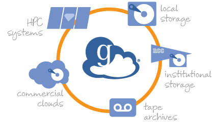

# Globus File Transfer

**_Abe, May 8th, 2020_**

## Description
  Setting up and using globus to transfer files between a local machine and server (uahpc)

**Software:  **Globus, UAHPC

**Datasets: **N/A

**Links: [https://www.globus.org/](https://www.globus.org/)**

---

Globus provides a simple way to transfer files between a local device and a server account instead of using scp or another file transfer method. It is especially useful for large sets of files. 

## Setting up Account: 

A good reference: [https://www.osc.edu/book/export/html/3578](https://www.osc.edu/book/export/html/3578)

1. To Login: Visit **[https://www.globus.org/](https://www.globus.org/)**, go to login and select “The University of Arizona”
2. You will be prompted to login with your UA NetID

## Set-up Endpoints:

Endpoints are essentially paths that are linked and configured for streamlined file transfer. Personal endpoints can be setup for personal systems: research desktop or personal laptop

1. When logged-in, click on “endpoints” on the left panel
2. At the top select “create personal endpoint”
3. Download Globus Connect Personal (follow the install instructions)
    1. You can select the default home directory or specify a different directory for the endpoint if you wish
    2. You will also name the endpoint (ex: “Abe’s Research Desktop”)
4.  You should now have a personal endpoint for the device which you are currently working on

## Transfering Files

To transfer files between this personal endpoint and the UAHPC server, you will have to search for it on the globus website:

1. When logged-in, click on “file manager” on the left panel
2. The left panel is where you want to transfer from...so to transfer something from your desktop click in the “collections” search bar and select the personal endpoint that you just created (for ex: “Abe’s Research Desktop”)
    1. From here you can navigate the system for the directory or files that you wish to transfer
3. On the right window panel is where you will select the server endpoint (or another personal endpoint). For UAHPC you search **UA HPC Filesystems**
    2. More info found here: [https://public.confluence.arizona.edu/display/UAHPC/Transferring+Files](https://public.confluence.arizona.edu/display/UAHPC/Transferring+Files)
4. Once in the UA server you can navigate your UAHPC directories and go to where you want to transfer the files. (I had to physically type in the directory I wanted on the HPC)
5. Click “Start” once the correct file and directories are selected. Note you can transfer to/from either endpoint
6. You’ll get a confirmation email once it was successfully transferred

Other links and resources:

Install guide of Mac: [https://docs.globus.org/how-to/globus-connect-personal-mac/](https://docs.globus.org/how-to/globus-connect-personal-mac/)

Penn State Explanation: [https://www.youtube.com/watch?v=iIfeVxplZ8U](https://www.youtube.com/watch?v=iIfeVxplZ8U)

## Extra Information for NCAR HPC (Cheyenne):

This link has helpful resources: [https://www2.cisl.ucar.edu/resources/storage-and-file-systems/globus-file-transfers](https://www2.cisl.ucar.edu/resources/storage-and-file-systems/globus-file-transfers) 

1. Log in to your Globus account 
2. Go to File manager
3. Go to panel view so you can see the source and destination of your files 
4. Type NCAR GLADE into the collection for either source or destination, select your personal endpoint for the other 
5. You will be asked to log in, use your normal log in credentials when you are accessing NCAR resources through terminal 
    1. Click advanced and for certificate length type ‘720’ this will allow you to extend the credential to 30 days as opposed to the usual 24 
6. You will authenticate your log in whatever way you have it set up, likely Duo
7. Go to /glade/scratch/”your_username” and you should see the file tree as you have it set up 
8. Start transfer!

## Information for Google Drive transfers:

Follow the steps in the link below to setup your Google Drive account as an endpoint.

[https://public.confluence.arizona.edu/display/UAHPC/Transferring+Files#TransferringFiles-GoogleDrive](https://public.confluence.arizona.edu/display/UAHPC/Transferring+Files#TransferringFiles-GoogleDrive)
