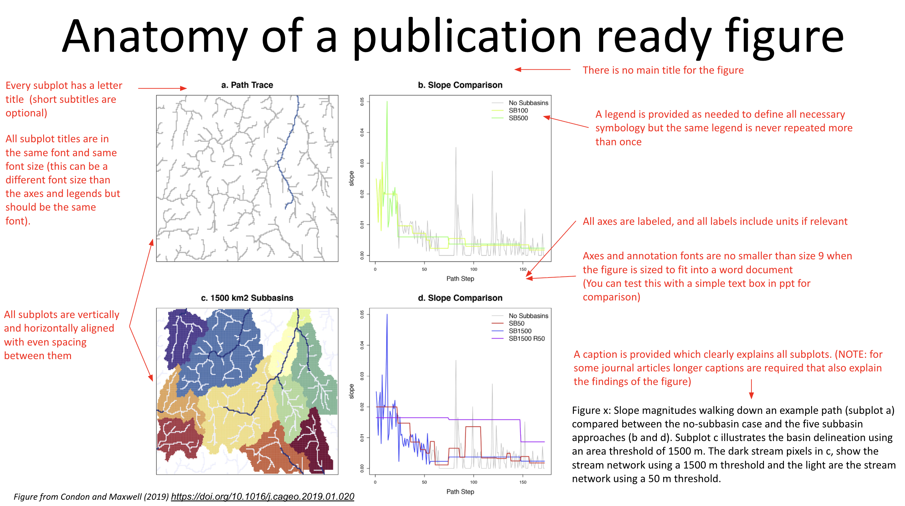
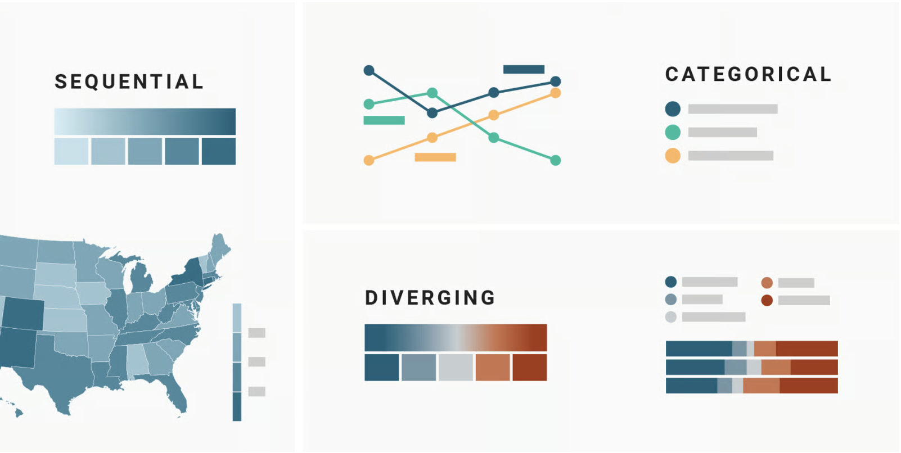
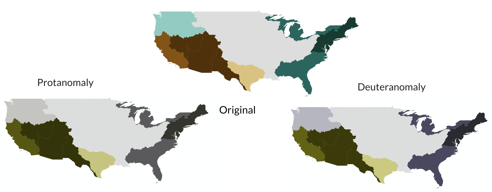
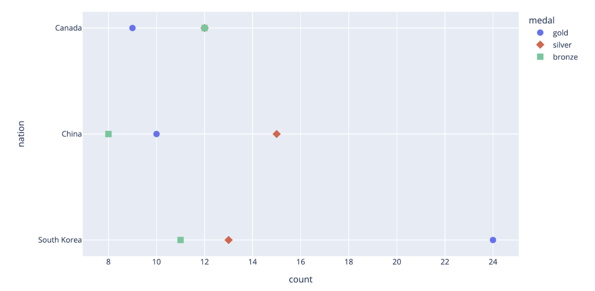

# Writing the Manuscript

Quick Access:

- [Creating publication-ready figures](#creating-publication-ready-figures)
- [Data and Code stored with appropriate links](#data-and-code-stored-with-appropriate-links)

---

## How to build a story board for your journal article
[This template](https://docs.google.com/presentation/d/1mOs9GQeXzpdUz7oXsork9p4GuLu6hA_ecqcAbT4xpFY/edit?slide=id.p#slide=id.p) should be used when you are at the beginning of writing your manuscript. This will help guide you on the content of your paper and finalizing your figures. 

When using this template, go to `File > Make a copy` to use and save it to your own drive.  

---

## Creating publication-ready figures
Creating figures takes multiple iterations. Here are some general guidelines for intuitive, understandable, and accurate publication-ready figures. 

### Use of Color 
- Match color scale type to data (sequential, diverging, categorical) 

- Be consistent with color choices across the paper 
- Ensure accessibility (colorblind-friendly, high contrast) 

### Symbology
- Differentiate variables with one visual cue (color, line type, symbol). If color is used to differentiate, oftentimes a different line type of symbol than the standard is not necessary. For example, it is unnecessary to have symbols and colors for the same thing. 

- Keep symbology consistent across all figures. 
- Make sure symbols and line types are readable at publication size. 
- Always simplify - avoid unnecessary symbol variations. 

### Layout & Text
- Scale figures to fit the page/half-page without excess white space 
- Maintain consistent subplot spacing and alignment 
- Label all axes (with units) and provide clear legends 
- Avoid repeating identical legends across subplots 
- Add subplot lettering (a, b, c, …) where needed
- Keep text legible - no font smaller than size 9
- Remove unnecessary borders on legends 
- Use annotations to guide interpretation

### Maps 
- Include scale bar and north arrow
- Add inset maps when the location context is unclear 
- Preserve the correct aspect ratio to avoid stretched maps 
- Use consistent basemaps and features across multiple maps 
- Ensure basemap/reference info supports the data without distracting from it

### Accessibility 
- Provide alt text for all figures
- Check and maintain sufficient color contrast 
- Test figures with a [colorblind simulator](https://www.color-blindness.com/coblis-color-blindness-simulator/)
- Use more than color alone to convey meaning 
- Provide data tables alongside graphics when possible

---

## Data and Code stored with appropriate links